  ⭐ Go Backend · DevOps · Web Infrastructure · Open-source Builder ⭐

  <a href="https://go-furry.com">GoFurry Website</a> ·
  <a href="https://github.com/gofurry/gofurry-nav-site">GoFurry Monorepo</a> ·
  <a href="mailto:2660621624@qq.com">Contact</a>

---

### [🐺GoFurry](https://go-furry.com) — Furry website directory and Steam game discovery platform

One of the largest furry-focused website directories, alongside a dedicated discovery and information platform for furry games on Steam.

1M+ deduplicated visits and 100K+ community video views. Curates furry websites, Steam games, rankings, release updates, performance data, and community resources.

Built and operated as a production multi-service system with Nuxt, Go/Fiber, PostgreSQL, Redis, Nginx, and Docker. Site-wide API P99 remains below 100ms, with more than 10M security and probe events processed.

### 🧰 Tech Stack

#### 🔹 Proficient Languages & Backend

#### 🔹 Frontend

#### 🔹 Operations

### 🎮 Steam

### 📊 GitHub Stats

  
  &nbsp;&nbsp;&nbsp;&nbsp;
  

## 🐲 Other Stats

---

### 📫 Contact Me
- Email: `2660621624@qq.com` 

